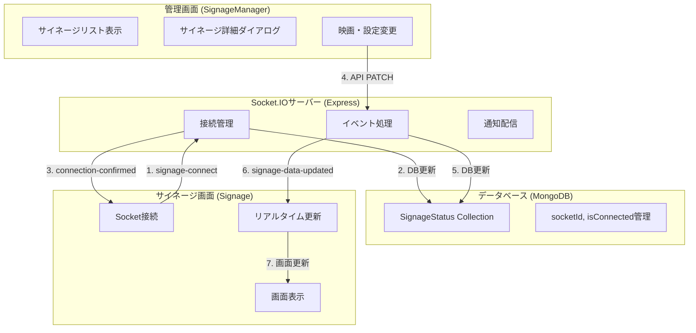
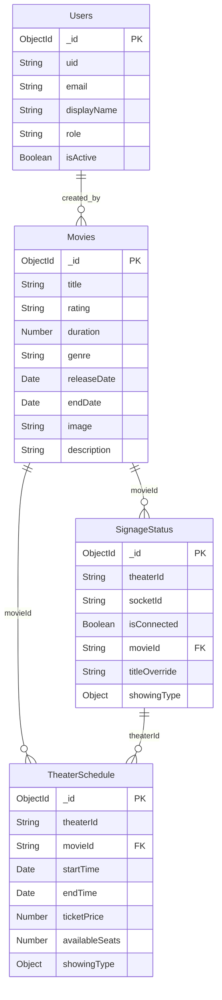

# 🎬 THEATER SIGNAGE SYSTEM

映画館向けサイネージ集中管理システム - リアルタイム通信対応

## 📋 プロジェクト概要

このシステムは映画館のデジタルサイネージを効率的に管理するための Web アプリケーションです。集中管理画面から各シアターのサイネージをリアルタイムで制御し、映画情報の表示・更新を行うことができます。

### 🎯 主な機能

- **映画データ管理**: 映画の登録、編集、削除
- **サイネージ集中管理**: 各シアターのサイネージを一元管理
- **リアルタイム更新**: Socket.IO による即座の画面反映
- **カスタムタイトル**: 特別上映用のタイトルオーバーライド
- **上映種別設定**: 字幕、吹替、4K、3D などの表示設定
- **接続状態監視**: サイネージのオンライン/オフライン状態表示

## 🏗️ システム構成

```
THEATER_SIGNAGE/
├── frontend/          # React.js フロントエンド
├── backend/           # Node.js + Express バックエンド
├── testdata/          # テストデータ
└── README.md
```

### 技術スタック

#### フロントエンド

- **React.js 19.1.1** - UI ライブラリ
- **Vite** - ビルドツール
- **Material-UI** - UI コンポーネント
- **SWR** - データフェッチング
- **Socket.IO Client** - リアルタイム通信
- **React Router** - ルーティング
- **CSS Modules** - スタイリング

#### バックエンド

- **Node.js** - サーバーサイドランタイム
- **Express.js 5.1.0** - Web フレームワーク
- **Socket.IO** - リアルタイム通信
- **MongoDB + Mongoose** - データベース
- **Firebase Admin** - 認証システム
- **JWT** - トークン認証

## 🚀 セットアップ手順

### 前提条件

- Node.js（v16 以上）
- MongoDB
- Firebase プロジェクト

### 1. リポジトリのクローン

```bash
git clone https://github.com/nas-onima/THEATER_SIGNAGE.git
cd THEATER_SIGNAGE
```

### 2. バックエンドセットアップ

```bash
cd backend

# 依存関係のインストール
npm install

# 環境変数の設定
cp .env.example .env
# .envファイルを編集して以下を設定:
# - MONGODB_URI
# - FIREBASE_CONFIG
# - JWT_SECRET

# サーバー起動
npm start
```

### 3. フロントエンドセットアップ

```bash
cd frontend

# 依存関係のインストール
npm install

# 開発サーバー起動
npm run dev
```

### 4. Firebase セットアップ

1. Firebase コンソールでプロジェクト作成
2. Authentication 有効化
3. サービスアカウントキーをダウンロード
4. `backend/config/serviceAccountKey.json`に配置
5. `frontend/src/firebase.js`で Firebase 設定

## 📡 Socket.IO 通信フロー

### システム通信概要図



### Socket.IO イベント通信表

| **イベント名**         | **方向**              | **送信者**      | **受信者**  | **データ形式**                           | **用途**           |
| ---------------------- | --------------------- | --------------- | ----------- | ---------------------------------------- | ------------------ |
| `signage-connect`      | サイネージ → サーバー | Signage.jsx     | server.js   | `{ theaterId: string }`                  | サイネージ接続登録 |
| `connection-confirmed` | サーバー → サイネージ | server.js       | Signage.jsx | `{ message: string, theaterId: string }` | 接続確認通知       |
| `signage-data-updated` | サーバー → サイネージ | signage.js(API) | Signage.jsx | `SignageObject`                          | データ更新通知     |
| `disconnect`           | 自動                  | Socket.IO       | server.js   | -                                        | 切断検知           |
| `connection-error`     | サーバー → サイネージ | server.js       | Signage.jsx | `{ message: string }`                    | エラー通知         |

### 通信フロー詳細シーケンス

| **段階** | **発生場所**   | **イベント/アクション**     | **送信データ**                            | **受信側処理**             | **データベース変更**                   |
| -------- | -------------- | --------------------------- | ----------------------------------------- | -------------------------- | -------------------------------------- |
| **1**    | サイネージ画面 | `signage-connect` 送信      | `{ theaterId: "1" }`                      | サーバーが theaterId 記録  | `socketId`, `isConnected: true`        |
| **2**    | サーバー       | `connection-confirmed` 送信 | `{ message, theaterId }`                  | サイネージが接続確認       | -                                      |
| **3**    | 管理画面       | 映画設定変更 API 実行       | `{ movieId, titleOverride, showingType }` | API 処理開始               | -                                      |
| **4**    | サーバー(API)  | データベース更新            | 設定データ                                | SignageStatus 更新         | 映画・設定データ更新                   |
| **5**    | サーバー(API)  | `signage-data-updated` 送信 | 更新済みサイネージデータ                  | 対象サイネージのみ受信     | -                                      |
| **6**    | サイネージ画面 | SWR キャッシュ更新          | 新しいデータ                              | 画面再レンダリング         | -                                      |
| **7**    | サイネージ画面 | 切断時処理                  | -                                         | サーバーが disconnect 検知 | `socketId: null`, `isConnected: false` |

### 接続ライフサイクル管理

#### 接続時シーケンス

```
サイネージ起動
    ↓
Socket.IO接続開始
    ↓
signage-connect(theaterId)送信
    ↓
サーバーがDB更新(socketId保存, isConnected: true)
    ↓
connection-confirmed受信
    ↓
接続状態表示: オンライン(緑)
```

#### 更新時シーケンス

```
管理画面で映画変更
    ↓
API PATCH /signages/:id
    ↓
データベース更新
    ↓
Socket.IO通知送信(該当サイネージのみ)
    ↓
サイネージでsignage-data-updated受信
    ↓
SWRキャッシュ更新
    ↓
画面リアルタイム更新
```

#### 切断時シーケンス

```
サイネージ閉じる/ネットワーク切断
    ↓
Socket.IO disconnect検知
    ↓
サーバーがDB更新(socketId: null, isConnected: false)
    ↓
接続状態表示: オフライン(赤)
```

### リアルタイム通信の特徴

#### ✅ 実装済み機能

- **個別通信**: 特定のサイネージのみに通知送信
- **接続状態管理**: DB でオンライン/オフライン管理
- **自動再接続**: Socket.IO 標準機能で接続断絶時自動復旧
- **エラーハンドリング**: 接続失敗・更新失敗の適切な処理

#### 🔧 技術仕様

- **プロトコル**: WebSocket (フォールバック: HTTP Long Polling)
- **認証**: なし (シンプルな theaterId 識別)
- **通信範囲**: 同一サイネージのみ (ブロードキャストなし)
- **データ形式**: JSON

#### 📊 パフォーマンス

- **レスポンス時間**: 数ミリ秒 (WebSocket 直接通信)
- **ポーリング削減**: 接続時は 5 秒間隔ポーリング停止
- **帯域幅削減**: 変更時のみデータ送信

#### 🎯 運用上の利点

| **従来 (ポーリング)**  | **現在 (Socket.IO)** |
| ---------------------- | -------------------- |
| 5 秒間隔で全データ取得 | 変更時のみ通知       |
| 無駄な通信多数         | 必要最小限の通信     |
| 最大 5 秒の遅延        | ほぼリアルタイム     |
| サーバー負荷高         | サーバー負荷軽減     |

## 📁 プロジェクト構造詳細

### フロントエンド (`/frontend`)

```
src/
├── components/           # 再利用可能コンポーネント
│   ├── movie/           # 映画関連コンポーネント
│   ├── movieDetailsDialog/    # 映画詳細ダイアログ
│   ├── movieRegistrationForm/ # 映画登録フォーム
│   ├── movieSelectionList/    # 映画選択リスト
│   ├── schedulePanel/     # スケジュールパネル
│   ├── signageDetailsDialog/  # サイネージ設定ダイアログ
│   ├── signageListItem/   # サイネージリストアイテム
│   └── topbar/           # トップバー
├── hooks/               # カスタムフック
├── pages/               # ページコンポーネント
│   ├── home/            # ホーム画面
│   ├── loading/         # ローディング画面
│   ├── login/           # ログイン画面
│   ├── movieList/       # 映画一覧画面
│   ├── register/        # 登録画面
│   ├── schedules/       # スケジュール画面
│   ├── signage/         # サイネージ表示画面
│   └── signageManager/  # サイネージ管理画面
├── assets/              # 静的リソース
├── App.jsx              # メインアプリケーション
├── firebase.js          # Firebase設定
└── main.jsx            # エントリーポイント
```

### バックエンド (`/backend`)

```
├── config/              # 設定ファイル
│   ├── db.js           # MongoDB接続設定
│   ├── firebaseAdmin.js # Firebase Admin設定
│   └── serviceAccountKey.json # Firebase認証キー
├── models/              # データモデル
│   ├── Movie.js        # 映画モデル
│   ├── SignageStatus.js # サイネージステータスモデル
│   ├── TheaterSchedule.js # シアタースケジュールモデル
│   └── User.js         # ユーザーモデル
├── routes/              # APIルート
│   ├── auth.js         # 認証関連API
│   ├── middleware.js   # ミドルウェア
│   ├── movies.js       # 映画関連API
│   ├── schedules.js    # スケジュール関連API
│   ├── signage.js      # サイネージ関連API
│   └── users.js        # ユーザー関連API
└── server.js           # サーバーエントリーポイント
```

## 🔌 API エンドポイント

### 映画管理

- `GET /api/movies` - 映画一覧取得（ページネーション対応）
- `POST /api/movies` - 映画登録
- `GET /api/movies/:id` - 特定映画取得
- `PATCH /api/movies/:id` - 映画更新
- `DELETE /api/movies/:id` - 映画削除

### サイネージ管理

- `GET /api/signages` - サイネージ一覧取得
- `GET /api/signages/:id` - 特定サイネージ取得
- `PATCH /api/signages/:id` - サイネージ更新（Socket.IO 通知付き）
- `DELETE /api/signages/:id` - サイネージ削除

### 認証

- `POST /api/auth/login` - ログイン
- `POST /api/auth/logout` - ログアウト
- `GET /api/auth/verify` - トークン検証

## 🎨 画面構成

### 1. 映画管理画面 (`/movieList`)

- 映画の一覧表示・検索・フィルタリング
- 新規映画登録フォーム
- リスト表示・ポスター表示の切り替え

### 2. サイネージ管理画面 (`/signageManager`)

- 全サイネージの一覧表示
- 接続状態の可視化
- 各サイネージの設定変更

### 3. サイネージ表示画面 (`/signage/:id`)

- 映画ポスターの全画面表示
- 上映種別の表示
- タイトルオーバーライド対応
- リアルタイム更新機能

### 4. 認証画面

- Firebase 認証によるログイン・登録
- セキュアなセッション管理

## 🔧 開発・運用

### 開発モード起動

```bash
# バックエンド
cd backend
npm run dev

# フロントエンド
cd frontend
npm run dev
```

### プロダクションビルド

```bash
# フロントエンド
cd frontend
npm run build

# ビルド結果確認
npm run preview
```

### 環境変数

#### バックエンド (`.env`)

```
PORT=5000
MONGODB_URI=mongodb://localhost:27017/theater_signage
JWT_SECRET=your_jwt_secret_key
FIREBASE_TYPE=service_account
FIREBASE_PROJECT_ID=your_project_id
# その他Firebase設定...
```

#### フロントエンド (`firebase.js`)

```javascript
const firebaseConfig = {
  apiKey: "your_api_key",
  authDomain: "your_auth_domain",
  projectId: "your_project_id",
  // その他Firebase設定...
};
```

## 📊 データベーススキーマ

### Movies Collection

| **フィールド名** | **データ型** | **必須** | **説明**               | **例**                          |
| ---------------- | ------------ | -------- | ---------------------- | ------------------------------- |
| `_id`            | ObjectId     | Yes      | MongoDB 自動生成 ID    | `507f1f77bcf86cd799439011`      |
| `title`          | String       | Yes      | 映画タイトル           | `"アベンジャーズ/エンドゲーム"` |
| `rating`         | String       | No       | レーティング           | `"PG-12"`, `"R-15+"`, `"G"`     |
| `duration`       | Number       | No       | 上映時間（分）         | `181`                           |
| `genre`          | String       | No       | ジャンル               | `"アクション/SF"`               |
| `releaseDate`    | Date         | No       | 公開日                 | `2019-04-26T00:00:00.000Z`      |
| `endDate`        | Date         | No       | 上映終了日             | `2019-07-26T00:00:00.000Z`      |
| `image`          | String       | No       | ポスター画像（Base64） | `"iVBORw0KGgoAAAANSUhEUgAA..."` |
| `description`    | String       | No       | 説明・あらすじ         | `"最強のヒーローたちが..."`     |
| `createdAt`      | Date         | Yes      | 作成日時               | `2024-01-01T00:00:00.000Z`      |
| `updatedAt`      | Date         | Yes      | 更新日時               | `2024-01-02T00:00:00.000Z`      |

### SignageStatus Collection

| **フィールド名** | **データ型** | **必須** | **説明**            | **例**                       |
| ---------------- | ------------ | -------- | ------------------- | ---------------------------- |
| `_id`            | ObjectId     | Yes      | MongoDB 自動生成 ID | `507f1f77bcf86cd799439012`   |
| `theaterId`      | String       | Yes      | シアター識別 ID     | `"1"`, `"2"`, `"A"`          |
| `socketId`       | String       | No       | Socket.IO 接続 ID   | `"abc123def456"`             |
| `isConnected`    | Boolean      | Yes      | 接続状態フラグ      | `true`, `false`              |
| `movieId`        | String       | No       | 表示中映画の ID     | `"507f1f77bcf86cd799439011"` |
| `titleOverride`  | String       | No       | カスタムタイトル    | `"特別先行上映"`             |
| `description`    | String       | No       | サイネージ説明      | `"1番スクリーン用"`          |
| `showingType`    | Object       | Yes      | 上映種別設定        | 下記参照                     |
| `createdAt`      | Date         | Yes      | 作成日時            | `2024-01-01T00:00:00.000Z`   |
| `updatedAt`      | Date         | Yes      | 更新日時            | `2024-01-02T00:00:00.000Z`   |

### ShowingType オブジェクト詳細

| **フィールド名** | **データ型** | **説明**           | **デフォルト値** |
| ---------------- | ------------ | ------------------ | ---------------- |
| `sub`            | Boolean      | 字幕版             | `false`          |
| `dub`            | Boolean      | 吹替版             | `false`          |
| `jsub`           | Boolean      | 日本語字幕版       | `false`          |
| `fourK`          | Boolean      | 4K 上映            | `false`          |
| `threeD`         | Boolean      | 3D 上映            | `false`          |
| `cheer`          | Boolean      | 応援上映           | `false`          |
| `live`           | Boolean      | ライブビューイング | `false`          |
| `greeting`       | Boolean      | 舞台挨拶           | `false`          |
| `greetingLive`   | Boolean      | 舞台挨拶中継       | `false`          |

### Users Collection

| **フィールド名** | **データ型** | **必須** | **説明**            | **例**                            |
| ---------------- | ------------ | -------- | ------------------- | --------------------------------- |
| `_id`            | ObjectId     | Yes      | MongoDB 自動生成 ID | `507f1f77bcf86cd799439013`        |
| `uid`            | String       | Yes      | Firebase UID        | `"firebase_uid_string"`           |
| `email`          | String       | Yes      | メールアドレス      | `"admin@theater.com"`             |
| `displayName`    | String       | No       | 表示名              | `"管理者"`                        |
| `role`           | String       | Yes      | ユーザー権限        | `"admin"`, `"manager"`, `"staff"` |
| `isActive`       | Boolean      | Yes      | アカウント有効状態  | `true`, `false`                   |
| `lastLoginAt`    | Date         | No       | 最終ログイン日時    | `2024-01-02T09:30:00.000Z`        |
| `createdAt`      | Date         | Yes      | 作成日時            | `2024-01-01T00:00:00.000Z`        |
| `updatedAt`      | Date         | Yes      | 更新日時            | `2024-01-02T00:00:00.000Z`        |

### TheaterSchedule Collection

| **フィールド名** | **データ型** | **必須** | **説明**            | **例**                       |
| ---------------- | ------------ | -------- | ------------------- | ---------------------------- |
| `_id`            | ObjectId     | Yes      | MongoDB 自動生成 ID | `507f1f77bcf86cd799439014`   |
| `theaterId`      | String       | Yes      | シアター識別 ID     | `"1"`, `"2"`, `"A"`          |
| `movieId`        | String       | Yes      | 上映映画の ID       | `"507f1f77bcf86cd799439011"` |
| `startTime`      | Date         | Yes      | 上映開始時刻        | `2024-01-02T14:30:00.000Z`   |
| `endTime`        | Date         | Yes      | 上映終了時刻        | `2024-01-02T17:31:00.000Z`   |
| `ticketPrice`    | Number       | No       | チケット料金        | `1800`                       |
| `availableSeats` | Number       | No       | 利用可能座席数      | `120`                        |
| `showingType`    | Object       | No       | 上映種別            | SignageStatus と同じ形式     |
| `createdAt`      | Date         | Yes      | 作成日時            | `2024-01-01T00:00:00.000Z`   |
| `updatedAt`      | Date         | Yes      | 更新日時            | `2024-01-02T00:00:00.000Z`   |

### データベース関連性



showingType: { // 上映種別
sub: Boolean, // 字幕版
dub: Boolean, // 吹替版
jsub: Boolean, // 日本語字幕版
fourK: Boolean, // 4K 上映
threeD: Boolean, // 3D 上映
cheer: Boolean, // 応援上映
live: Boolean, // ライブビューイング
greeting: Boolean, // 舞台挨拶
greetingLive: Boolean // 舞台挨拶中継
}
}

```

## 👨‍💻 開発者

- **nas-onima** - _Initial work_ - [GitHub](https://github.com/nas-onima)


**更新日**: 2025年10月4日
**バージョン**: 1.0.0
**Node.js**: v16以上推奨
**MongoDB**: v4.4以上推奨
```
