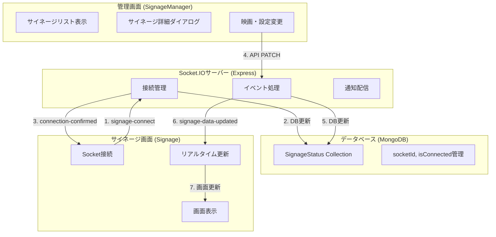

```mermaid
graph TB
    subgraph "管理画面 (SignageManager)"
        A[サイネージリスト表示]
        B[サイネージ詳細ダイアログ]
        C[映画・設定変更]
    end
    
    subgraph "Socket.IOサーバー (Express)"
        D[接続管理]
        E[イベント処理]
        F[通知配信]
    end
    
    subgraph "データベース (MongoDB)"
        G[SignageStatus Collection]
        H[socketId, isConnected管理]
    end
    
    subgraph "サイネージ画面 (Signage)"
        I[画面表示]
        J[Socket接続]
        K[リアルタイム更新]
    end
    
    J -->|1. signage-connect| D
    D -->|2. DB更新| G
    D -->|3. connection-confirmed| J
    C -->|4. API PATCH| E
    E -->|5. DB更新| G
    E -->|6. signage-data-updated| K
    K -->|7. 画面更新| I
```